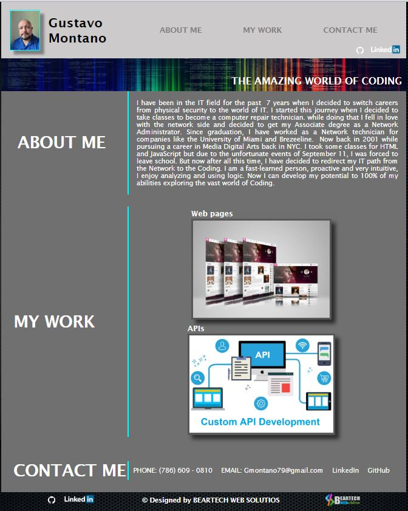
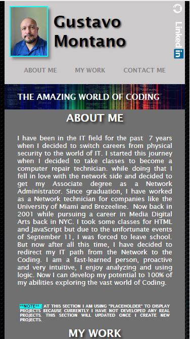

# Gustavo Montano Portfolio

## Description

This website has been created to serve as Portfolio for my career as a Web Developer

## Installation

N/A

## Usage

To use this page, simple you can navigate thru the different sections such as About me, where you can get to know a little more about my professional background in the IT field. Also you can have a section about the projects i ahve been working so far. And finally you can have a section about how I can be contact and the links to my profesional profile at GitHub and LinkedIn.

**NOTE** : AT THIS SECTION I AM USING "PLACEHOLDER" TO
DISPLAY PROJECTS BECAUSE CURRENTLY I HAVE NOT DEVELOPED ANY REAL
PROJECTS. THIS SECTION WILL UPDATED ONCE I CREATE NEW PROJECTS.

The deployment application link is https://gmontano79.github.io/portfolio/

### **Desktop View**

### **Mobile View**

## Credits

N/A

## License

Please refer to the LICENSE in the repo.
